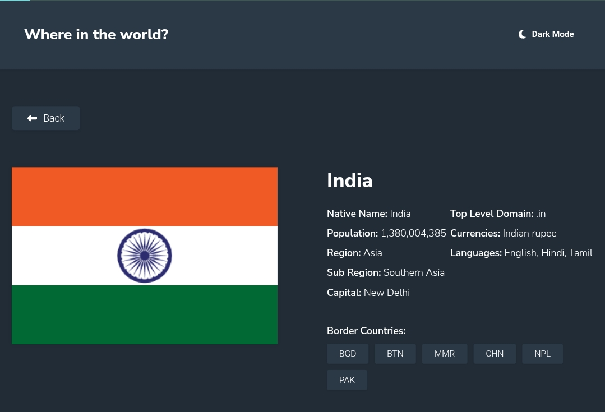

# Frontend Mentor - REST Countries API with color theme switcher solution

This is a solution to the [REST Countries API with color theme switcher challenge on Frontend Mentor](https://www.frontendmentor.io/challenges/rest-countries-api-with-color-theme-switcher-5cacc469fec04111f7b848ca). Frontend Mentor challenges help you improve your coding skills by building realistic projects.

## Table of contents

- [Overview](#overview)
  - [The challenge](#the-challenge)
  - [Screenshot](#screenshot)
  - [Links](#links)
- [My process](#my-process)
  - [Built with](#built-with)
  - [What I learned](#what-i-learned)
  - [Continued development](#continued-development)
  - [Useful resources](#useful-resources)
- [Author](#author)
- [Acknowledgments](#acknowledgments)

## Overview

### The challenge

Users should be able to:

- See all countries from the API on the homepage
- Search for a country using an `input` field
- Filter countries by region
- Click on a country to see more detailed information on a separate page
- Click through to the border countries on the detail page
- Toggle the color scheme between light and dark mode

### Screenshot

### Links

- Solution URL: [https://www.frontendmentor.io/solutions/get-detailed-country-insights-using-rest-countries-api-qTI1_Tq0N8](https://www.frontendmentor.io/solutions/get-detailed-country-insights-using-rest-countries-api-qTI1_Tq0N8)
- Live Site URL: [https://nationiq.glitch.me/](https://nationiq.glitch.me/)

## My process

### Built with

- Semantic HTML5 markup
- CSS custom properties
- Flexbox
- CSS Grid
- JavaScript

### What I learned

In this project, I learned how to effectively integrate a REST API into a web application and utilize the data to dynamically generate content. I also improved my skills in implementing a theme switcher feature for toggling between light and dark modes. Additionally, I gained experience on how to implement routing using page hash.

### Continued development

In future projects, I plan to further enhance my understanding about routing to streamline development processes. I also aim to improve my CSS skills and focus on creating more responsive and visually appealing designs.

### Useful resources

- [MDN Web Docs](https://developer.mozilla.org/) - Comprehensive documentation for web technologies.
- [Frontend Mentor](https://www.frontendmentor.io/) - Provides realistic challenges to improve frontend coding skills.

## Author

- Frontend Mentor - [@LakhinarPal](https://www.frontendmentor.io/profile/LakhinarPal)
- Portfolio - [https://lakhindar.is-a.dev](https://lakhindar.is-a.dev)

## Acknowledgments

I would like to thank the Frontend Mentor discord community for providing valuable feedback and support throughout the development process. Additionally, I appreciate the creators of the REST Countries API for making it freely accessible for developers to use in their projects.
